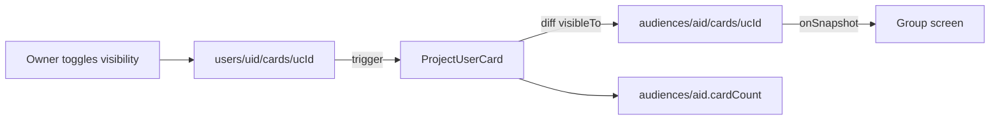

# Toli — Architecture and build plan

2026-09-18 · Raja Jain

Living copy: https://claude.ai/code/artifact/3db2e808-748c-42f2-b83a-dd648cf20eed

## Principles

Four rules decide every structural question in the codebase.

1. **Dependency rule.** Domain knows nothing about Firebase, React or Next. Application (use cases) knows domain and port interfaces. Infrastructure implements the ports. Presentation calls use cases. Enforced by package boundaries and an ESLint rule, not by discipline.
2. **CQRS-lite from day one.** Owners write to their own documents; a Cloud Function projects those writes into read models that screens query. This is what lets Firestore serve a group screen in one query at any user count.
3. **The client never writes shared state.** Every group, share, invite or read-model mutation goes through a callable or a trigger. Rules stay small enough to test exhaustively.
4. **Speed is architecture, not polish.** Offline-first cache, live listeners, optimistic updates and a static catalogue are decided here, not bolted on later.

## Monorepo layout

One repo, `github.com/rajajain08/toli`, pnpm workspaces + Turborepo. `domain` and `application` hold all the logic and run unchanged in web, functions and tests; everything else is glue.

```
toli/
  packages/
    domain/          entities, value objects, domain errors      - zero dependencies
    application/     use cases + port interfaces                 - depends on domain
    infra-client/    Firebase client SDK adapters (web)          - implements ports
    infra-admin/     Firebase Admin SDK adapters (functions)     - implements ports
    catalog/         cards.json + validator + types              - shared seed
    ui/              design tokens and primitives from the mockups
  apps/
    web/             Next.js 15 PWA (presentation + composition root)
    functions/       Cloud Functions, thin handlers that call use cases
  firestore.rules / firestore.indexes.json / firebase.json
  .github/workflows/ci.yml
  docs/              this plan, decisions/ADR-000x.md
```

| Package | May import | Never imports |
| --- | --- | --- |
| domain | nothing | anything |
| application | domain | firebase, react, next |
| infra-client, infra-admin | domain, application, firebase | react, next |
| ui | react | firebase, application |
| apps/web | everything | - |
| apps/functions | domain, application, infra-admin | react, next, infra-client |

The composition root (`apps/web/src/lib/container.ts` and `apps/functions/src/container.ts`) is the only place an adapter and a use case meet.

## Domain

Six entities, and one modelling decision that simplifies everything: **a 1:1 share is an Audience with `type: 'direct'` and two members.** Every screen, rule and function treats it like a group; only the UI label differs.

```ts
UserId, GroupId, UserCardId, CardId, InviteCode      // branded string types
User         { id, name, phoneHash, consentAt, createdAt }
CatalogCard  { id, name, issuer, bank, tags[], perks[], color }   // read-only reference data
UserCard     { id, ownerId, cardId, visibleTo: Set<GroupId>, addedAt }
Audience     { id, type: 'group' | 'direct', name?, createdBy, memberCount, cardCount }
Membership   { audienceId, userId, joinedAt, role: 'owner' | 'member' }
Invite       { code, audienceId, expiresAt, uses, maxUses }
```

Invariants live on the entities as methods so they cannot be skipped:

- `UserCard.show(audienceId)` / `.hide(audienceId)` - a card is visible to at most 50 audiences.
- `Audience.canAccept(memberCount)` - 50 members per audience for MVP.
- `Audience.directId(a, b)` - deterministic `direct_<min>_<max>`, so a 1:1 share can never exist twice.
- `Invite.isValidAt(now)` - 8 characters, 7-day expiry, `maxUses`.
- `User` holds no phone number; the verified number lives in the separate, server-only `ContactRecord` (ADR-0013). No entity holds a card number, limit or spend. There is no field for them.

## Application layer

Use cases are classes with one `execute`, depending only on port interfaces. They are tested with in-memory ports in Vitest - no emulator, milliseconds per test.

**Ports**

| Port | Methods | Implemented by |
| --- | --- | --- |
| UserRepository | get, upsert | client, admin |
| UserCardRepository | listByOwner, get, save, remove | client |
| AudienceRepository | get, create, addMember, removeMember, isMember, listForUser | client (read), admin (write) |
| InviteRepository | get, create, consume | admin only |
| GroupCardReadModel | listByAudience, findHolders, project, unproject | client (read), admin (write) |
| Clock, IdGenerator, RateLimiter | - | trivial |

**Use cases**

| Runs on | Use case |
| --- | --- |
| client | AddUserCard, RemoveUserCard, SetCardVisibility, ListMyCards, ListAudienceCards, FindCardHolders |
| functions | CreateAudience, JoinByInvite, ShareWith, ProjectUserCard (fan-out), DeleteAccount, Nudge |

```ts
export class SetCardVisibility {
  constructor(private cards: UserCardRepository, private audiences: AudienceRepository) {}
  async execute(cmd: { actor: UserId; cardId: UserCardId; audienceId: GroupId; visible: boolean }) {
    const card = await this.cards.get(cmd.actor, cmd.cardId);
    if (!card) throw new NotFound('card');
    if (!(await this.audiences.isMember(cmd.audienceId, cmd.actor))) throw new NotAMember();
    await this.cards.save(cmd.visible ? card.show(cmd.audienceId) : card.hide(cmd.audienceId));
  }
}
```

## Firestore design

Every screen is one query; every shared document is written only by a function. Region `asia-south1`.

```
users/{uid}                        { name, phoneHash, consentAt, createdAt }
users/{uid}/cards/{ucId}           { cardId, visibleTo: [audienceId], addedAt }        <- write side
users/{uid}/memberships/{aid}      { type, name, joinedAt }                             <- user's audience list
audiences/{aid}                    { type, name, createdBy, memberCount, cardCount }
audiences/{aid}/members/{uid}      { joinedAt, role, name }
audiences/{aid}/cards/{ucId}       { ownerId, ownerName, cardId, name, issuer, color, tags[], addedAt }  <- read side
invites/{code}                     { audienceId, expiresAt, uses, maxUses }
contacts/{uid}                     { phone, marketingOptIn, marketingOptInAt?, updatedAt }   <- server-only, ADR-0013
ratelimits/{uid}                   { joinAttempts: [ts] }
catalog/{cardId}                   mirror of cards.json, for server-side validation only
```

**Write side to read side**



The owner writes once; the function diffs `before.visibleTo` against `after.visibleTo`, then `set(merge)` into each added audience and `delete` from each removed one, in a single batch.

**Why it scales**

- No unbounded arrays. Members are a subcollection, so an audience document never grows and never becomes a write hot-spot. Rules check `exists(.../members/{uid})`: one read, O(1).
- Fan-out is bounded by the domain (50 audiences per card), so one write triggers at most 50 read-model writes, well under the 500-op batch limit.
- Projection is idempotent. Triggers are at-least-once; `set(merge)` and `delete` tolerate redelivery, so there is no dedupe table.
- Counters (`memberCount`, `cardCount`) are maintained by the same function. At 50 members they will never need sharding.

**Find, by stage**

| Stage | How | Limit |
| --- | --- | --- |
| MVP | one query per membership, `audiences/{aid}/cards where cardId == X`, in parallel | ~10 audiences per user |
| v2 | `collectionGroup('cards')` with `audienceId in [...]`, chunks of 30 | hundreds of audiences |
| v3 | Typesense, fed by the projection function | fuzzy search, any scale |

The `FindCardHolders` use case is unchanged across stages; only the adapter changes.

## Security

Rules stay around 40 lines because the client can only touch its own documents.

```
match /users/{uid}/{doc=**}   { allow read, write: if request.auth.uid == uid; }
match /audiences/{aid} {
  allow read:  if exists(/databases/$(db)/documents/audiences/$(aid)/members/$(request.auth.uid));
  allow write: if false;
  match /{sub=**}/{id} { allow read: if <same exists check>; allow write: if false; }
}
match /invites/{c}   { allow read, write: if false; }
match /contacts/{u}  { allow read, write: if false; }
match /catalog/{c}   { allow read: if request.auth != null; allow write: if false; }
```

- **App Check** (reCAPTCHA Enterprise) required on every callable and on Firestore from day one; phone auth without it gets abused.
- **Rate limits** inside `JoinByInvite` and `ShareWith`: per-uid sliding window in `ratelimits/{uid}`.
- **Invite codes**: 8 characters from a 32-character alphabet, 7-day expiry, `maxUses`; never readable by clients, so nobody can enumerate them.
- **Phone numbers** (ADR-0013): the verified number lives in `contacts/{uid}`, server-only, with a separate opt-in flag for marketing; no client can read it, the owner included. `users/{uid}` keeps only the HMAC-SHA256 for "is this person on Toli". Never displayed to anyone.
- **DPDP**: consent timestamp recorded at signup, privacy page with a grievance contact, and `DeleteAccount` cascades through memberships, read-model rows and the auth user. It is the only path that deletes `users/{uid}`.
- **Never stored, no field exists**: card number, expiry, CVV, limit, spend, statements.

## Presentation and performance

Everything behind auth is a client-rendered shell over a local cache; the one server-rendered route is the invite link, because WhatsApp previews depend on it.

**Rendering model**

- Authenticated routes: client components, data from Firestore listeners. Nothing to SSR.
- `/join/[code]`: a server component that reads a public preview through `infra-admin` and renders Open Graph tags (group name, member count, card count). This is what makes the link unfurl in WhatsApp; without it the invite is a bare URL.

**Data layer**

- TanStack Query is the single cache. Firestore `onSnapshot` listeners push into it via `setQueryData`, so every list is live (a friend adds a card, it appears) with stale-while-revalidate for free.
- One hook, `useLiveCollection(queryKey, firestoreQuery)`; every list screen uses it. Subscribe on mount, unsubscribe on unmount, one listener per collection on screen.
- Optimistic mutations for add, remove and toggle, exactly the feel of the prototype, with rollback on error.

**Instant screens**

- Firestore `persistentLocalCache` with multi-tab support: second launch renders from IndexedDB before the network answers.
- The catalogue is not a Firestore read. `packages/catalog/cards.json` (~40 cards, ~10 KB) ships in the bundle; Add cards search and bank filters run in memory and work offline.
- Firebase modular imports only; Auth and reCAPTCHA load lazily on the OTP route; the Functions client loads lazily.
- `packages/ui` holds the tokens (role-named palette: paper, ink, accent; type scale, card gradient, three elevation levels) and the primitives from the canvas: `CardTile`, `Chip`, `Toggle`, `AvatarRow`, `TabBar`. Screens compose these; nothing styles itself ad hoc.
- `joinByInvite` and `createAudience` sit on the user's critical path, so they run with `minInstances: 1` in prod; projection and delete can cold-start.

**Budgets, enforced in CI**

| Metric | Budget | Tool |
| --- | --- | --- |
| Initial JS, gzipped | <= 180 KB | size-limit |
| LCP, mid-range Android, throttled 4G | <= 2.5 s | Lighthouse CI |
| Cumulative layout shift | 0 from skeletons | Lighthouse CI |
| Firestore reads per group-screen open, warm cache | deltas only | manual check on Performance Monitoring |

## Testing pyramid

Four tiers, all on every PR; nothing deploys without green.

| Tier | Tool | Covers |
| --- | --- | --- |
| domain + application | Vitest with in-memory ports | every invariant and use case; hundreds of tests in seconds |
| rules | `@firebase/rules-unit-testing` + emulator | every allow and deny, including non-member reads and a tampered `ownerId` |
| functions | emulator integration | projection diffs, join rate limits, delete cascade, redelivery idempotency |
| web | Playwright against emulators | one golden path: open invite, OTP, add two cards, see them in the group |

## Environments, delivery and observability

Two Firebase projects, one pipeline, and rules and functions always deploy with the app so they cannot drift.

| Item | Choice |
| --- | --- |
| Projects | `toli-dev`, `toli-prod`; local work on emulators with seeded data |
| Hosting | Firebase App Hosting for the Next.js app |
| CI/CD | GitHub Actions: PR runs all four test tiers; merge to `main` deploys dev; a tag deploys prod |
| Flags | Remote Config, e.g. `directSharesEnabled`, so features ship dark and switch on per cohort |
| Client metrics | Firebase Performance Monitoring for real-user LCP and TTI |
| Product events | GA4: `invite_opened`, `otp_completed`, `card_added`, `group_joined`, `visibility_changed`, `find_used` |
| Server | Cloud Logging + Error Reporting, one structured log line per use case execution |
| Analytics warehouse | Firestore to BigQuery export, once retention curves matter |

## Growth path

The domain and application packages do not change at any stage below; only adapters and infrastructure settings do.

| Users | What changes |
| --- | --- |
| 0 to 10k | Nothing beyond this document. Firestore free tier covers most of it. |
| 10k to 100k | `minInstances` on the callables, the collectionGroup Find adapter, BigQuery export. Costs are read-dominated; offline cache and listeners keep reads to deltas. |
| 100k to 1M | Shard `cardCount` on any hot audience, move Find to Typesense, consider Cloud Run for heavier functions. |

**Mobile.** The logic packages are TypeScript, so Expo / React Native reuses them wholesale; Flutter would mean re-implementing every use case in Dart. Expo is the mobile path when the PWA stops being enough. This changes nothing today, but it is why the packages are shaped this way.

## Milestones

Milestone 4 is the MVP. If the friend group does not use it after that, 5 and 6 do not matter.

| # | Milestone | Done when |
| --- | --- | --- |
| 1 | Skeleton: monorepo, packages wired, empty Next app, emulators, CI, ADR-0001 | a PR runs all four test tiers |
| 2 | Identity: OTP, name, consent, `users/{uid}`, App Check | a fresh phone can sign up on the dev URL |
| 3 | My cards: catalogue package, Add cards, My cards with optimistic add and remove | usable as a single-player app |
| 4 | Audiences: CreateAudience, `/join/[code]` with OG tags, JoinByInvite, projection, Group screen live, visibility toggles | the friend group is on it |
| 5 | Direct shares and Find | a card can be shared 1:1 and found across audiences |
| 6 | Privacy page, delete account, PWA install prompt, analytics, prod deploy | live on `toli-prod` |

## Decision log

One row per architectural decision; add a row and an ADR file under `docs/decisions/` whenever one changes.

| ADR | Decision | Why |
| --- | --- | --- |
| 0001 | Firebase only: Auth, Firestore, Functions, App Hosting | one console, one billing account, one deploy pipeline |
| 0002 | CQRS-lite: owner-owned write side, function-projected read side | one query per screen at any scale |
| 0003 | Client never writes shared state | rules stay small and fully testable |
| 0004 | A 1:1 share is a two-member `direct` audience | one code path for groups, shares, rules and search |
| 0005 | Members in a subcollection, not an array on the audience | no hot-spot, O(1) rules check |
| 0006 | Catalogue shipped as versioned JSON in the repo | instant, offline, PR-reviewed edits |
| 0007 | 50 members per audience, 50 audiences per card, for MVP | bounds fan-out and batch size |
| 0008 | Expo over Flutter as the eventual mobile path | reuses the TypeScript logic packages |
| 0009 | No in-app "who should pay" recommendation | the app stays a plain directory of who holds what |
| 0010 | Phone OTP by SMS for MVP; WhatsApp OTP in phase 2 | not a Firebase provider; needs MSG91 plus custom tokens |
| 0011 | Packages ship TypeScript source; functions bundled by esbuild | no dist/ drift, one-file functions artefact without workspace deps |
| 0012 | Cool palette (Frost, Midnight, Iris) with role-named tokens; Fraunces display face | the app gets its own character; the next repaint is a one-file change |
| 0013 | Verified phone stored server-only in `contacts/{uid}`, with a separate marketing opt-in | the business can reach its users; DPDP needs purpose-specific consent |
